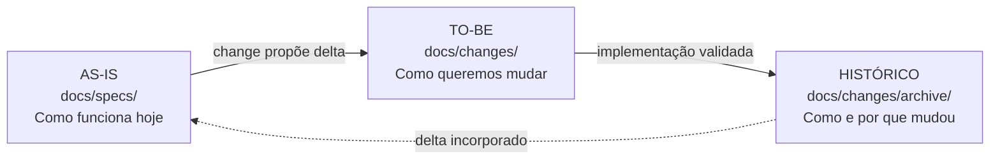

# Guia da documentação

Este diretório mantém o conhecimento necessário para entender o TapePilot e
controlar sua evolução. A documentação segue esta separação:

## Por onde começar

Para conhecer o projeto:

1. Leia o [README principal](../README.md).
2. Entenda a [visão do produto](product-vision.md).
3. Consulte o [guia de uso](user-guide.md).
4. Veja a [arquitetura](architecture.md) e o
   [modelo da simulação](simulation-model.md).
5. Use o [inventário](implementation-inventory.md) para relacionar requisitos,
   código e testes.

## Comportamento vigente — AS-IS

As [specs de capacidade](specs/README.md) são a fonte de verdade do que o
sistema deve fazer hoje. Estão divididas por assunto, como transporte, controle,
falhas, visualização, telemetria e runtime.

Cada capacidade contém:

- `spec.md`: requisitos e critérios vigentes;
- `design.md`: solução técnica atual;
- `tasks.md`: trabalho já realizado para estabelecer a capacidade.

## Mudanças propostas — TO-BE

As [changes](changes/README.md) descrevem alterações ainda não incorporadas ao
sistema. Cada mudança contém:

- `proposal.md`: problema, objetivo e impacto;
- `spec-delta.md`: diferença exata entre AS-IS e TO-BE;
- `design.md`: solução técnica proposta;
- `tasks.md`: trabalho necessário.

Quando uma change é concluída, seu delta é incorporado às specs vigentes e a
change é movida para `changes/archive/`.

## Outros documentos

- [Roadmap](roadmap.md): ideias futuras ainda sem compromisso de implementação.
- [Visão do produto](product-vision.md): problema, valor e caminho até hardware.
- [Gestão do projeto](project-management.md): backlog, Project, sprints e fluxo
  de trabalho.
- [ADRs](decisions/README.md): decisões técnicas duradouras e suas razões.
- [Desenvolvimento](development.md): ambiente, comandos e validações.
- [Glossário](glossary.md): vocabulário do domínio.

## Regra prática

| Pergunta | Onde consultar |
|---|---|
| Como funciona hoje? | `specs/` |
| O que queremos mudar? | `changes/<mudança>/spec-delta.md` |
| Por que mudar? | `changes/<mudança>/proposal.md` |
| Como será implementado? | `changes/<mudança>/design.md` |
| O que falta fazer? | `changes/<mudança>/tasks.md` |
| O que talvez seja feito depois? | `roadmap.md` |
| Por que uma decisão foi tomada? | `decisions/` |
| Como o trabalho é priorizado e acompanhado? | `project-management.md` |

## Diagramas

Diagramas de fluxo, componentes, estados, sequência e hierarquia devem usar
[Mermaid](https://mermaid.js.org/), em blocos cercados identificados por
`mermaid`. Blocos `text` permanecem reservados para fórmulas, formatos literais
e exemplos que não representam relações visuais.

Documente somente o necessário para definir comportamento, decisão, validação
ou contexto duradouro. Detalhes evidentes no código não precisam ser repetidos.
