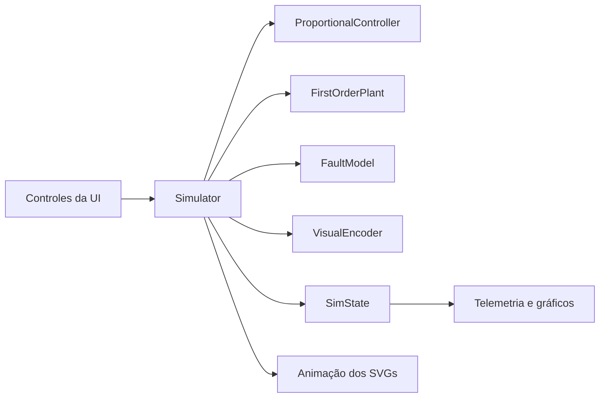
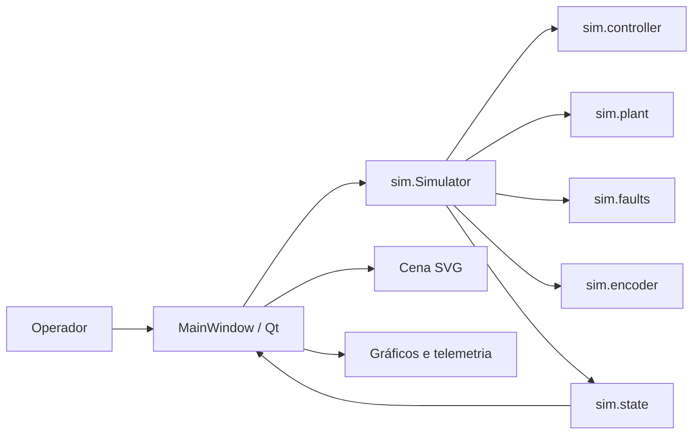
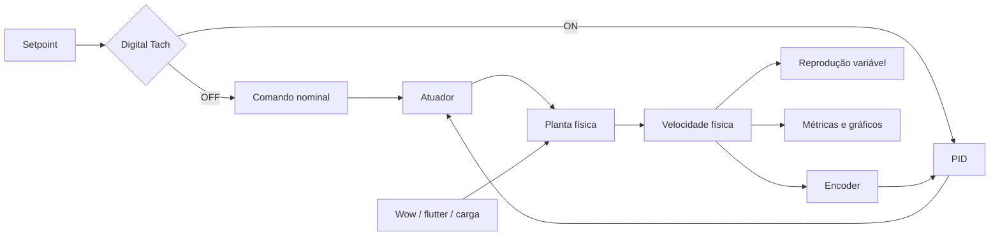

# Arquitetura

## Visão geral

O TapePilot é uma aplicação desktop pequena, com o núcleo da simulação separado
da interface. A janela está em `app.py`; estado e modelo estão em `sim/`.

Essa organização é adequada para provar a ideia, mas não é o destino
arquitetural do projeto.

## Componentes atuais

### `sim.SimState`

É um `dataclass` que representa o estado instantâneo:

- modo de transporte;
- RPM desejada e simulada;
- PWM e erro de controle;
- tensão simulada;
- intensidade das falhas;
- ângulos visuais das bobinas e do capstan.

### `sim.Simulator`

Permanece como fachada compatível, recebe comandos de transporte e coordena:

- `ProportionalController`, em `sim/controller.py`;
- `FirstOrderPlant`, em `sim/plant.py`;
- `FaultModel`, em `sim/faults.py`;
- `VisualEncoder`, em `sim/encoder.py`;
- `SimState`, em `sim/state.py`.

As fórmulas e o fluxo observável permanecem os mesmos do baseline. O encoder
ainda produz apenas jitter visual; seu modelo discreto pertence à evolução
aprovada, não ao estado atual.

### `MainWindow`

É responsável pela aplicação Qt:

- cria a cena e carrega os SVGs;
- conecta os botões e sliders;
- mostra a telemetria;
- mantém os buffers dos gráficos;
- aciona `Simulator.step(dt)` por meio de um `QTimer` de 16 ms;
- redesenha os componentes e gráficos.

## Fluxo de execução

1. `main()` cria `QApplication` e `MainWindow`.
2. `MainWindow` inicia um timer com intervalo nominal de 16 ms.
3. A cada `tick()`, a interface lê os sliders e mede o tempo transcorrido.
4. `Simulator.step(dt)` modifica o estado.
5. A interface atualiza SVGs, texto e gráficos.
6. Os gráficos preservam uma janela deslizante de 20 segundos.

## Assets

Cada elemento móvel é um `QGraphicsSvgItem`. Os arquivos estão em
`assets/svg/`. Como os SVGs foram exportados em 800 × 800 px, a interface aplica
uma escala explícita, preservando a proporção:

- bobinas: 180 px de largura;
- capstan: 70 px de largura.

Os caminhos dos assets são relativos à raiz do repositório.

## Limitações arquiteturais

- A taxa da simulação está ligada à taxa de atualização da interface.
- A fachada ainda coordena setpoints e movimento mecânico no mesmo passo.
- O encoder extraído ainda representa somente a medição visual vigente.
- Parâmetros estão fixos no código.

## Direção desejada

A evolução pretendida separa planta, controle, sensor, perturbações, áudio e
apresentação:

```mermaid
flowchart TD
    Root["tapepilot-sim/"] --> App["app.py — existente"]
    Root --> Sim["sim/"]
    Sim --> Model["model.py — existente; decomposição gradual"]
    Sim --> State["state.py — existente"]
    Sim --> Plant["plant.py — existente; evolução aprovada"]
    Sim --> Controller["controller.py — existente; evolução aprovada"]
    Sim --> Encoder["encoder.py — existente; evolução aprovada"]
    Sim --> Faults["faults.py — existente; evolução aprovada"]
    Sim --> Metrics["metrics.py — planejado"]
    Root --> Audio["audio/"]
    Audio --> Source["source.py — planejado"]
    Audio --> Playback["playback.py — planejado"]
    Root --> UI["ui/"]
    UI --> MainWindow["main_window.py — planejado"]
    UI --> Scene["mechanics_scene.py — planejado"]
    UI --> Plots["plots.py — planejado"]
    Root --> Tests["tests/"]
    Tests --> SimulatorTest["test_simulator.py — existente"]
    Tests --> PlantTest["test_plant.py — planejado"]
    Tests --> ControllerTest["test_controller.py — planejado"]
```

Os arquivos marcados como planejados representam a direção futura. A migração
deve ser incremental e coberta pelos testes de caracterização existentes.

As responsabilidades vigentes são normatizadas pelas
[specs de capacidade](specs/README.md). Alterações arquiteturais observáveis
devem começar por uma proposta em `docs/changes/` e, quando duradouras, por um
novo ADR.

## Diagrama de componentes

## Arquitetura-alvo do servo digital

O áudio consome a velocidade física. Ruído do encoder só pode afetá-lo
indiretamente pela reação do controlador sobre a planta.
