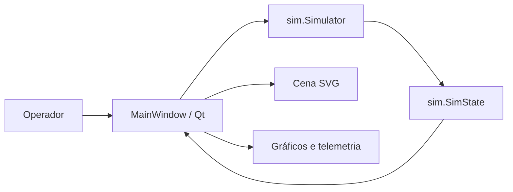
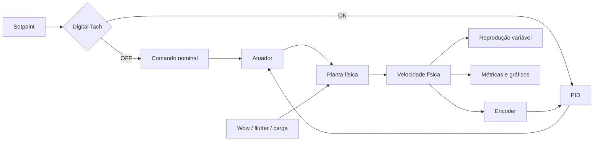

# Arquitetura

## Visão geral

O TapePilot é uma aplicação desktop pequena, com o núcleo da simulação separado
da interface. A janela está em `app.py`; estado e modelo estão em `sim/`.

```text
Controles da UI ──► Simulator ──► SimState ──► telemetria e gráficos
                         │
                         └───────────────────► animação dos SVGs
```

Essa organização é adequada para provar a ideia, mas não é o destino
arquitetural do projeto.

## Componentes atuais

### `sim.SimState`

É um `dataclass` que representa o estado instantâneo:

- modo de transporte;
- RPM desejada e simulada;
- PWM e erro de controle;
- tensão simulada;
- intensidade das falhas;
- ângulos visuais das bobinas e do capstan.

### `sim.Simulator`

Recebe comandos de transporte e executa um passo da simulação. Atualmente ele:

1. escolhe o setpoint do modo;
2. calcula o erro e o comando proporcional;
3. aplica a carga equivalente ao atrito;
4. atualiza a RPM por uma resposta de primeira ordem;
5. adiciona jitter à velocidade usada na animação;
6. atualiza os ângulos dos elementos mecânicos.

### `MainWindow`

É responsável pela aplicação Qt:

- cria a cena e carrega os SVGs;
- conecta os botões e sliders;
- mostra a telemetria;
- mantém os buffers dos gráficos;
- aciona `Simulator.step(dt)` por meio de um `QTimer` de 16 ms;
- redesenha os componentes e gráficos.

## Fluxo de execução

1. `main()` cria `QApplication` e `MainWindow`.
2. `MainWindow` inicia um timer com intervalo nominal de 16 ms.
3. A cada `tick()`, a interface lê os sliders e mede o tempo transcorrido.
4. `Simulator.step(dt)` modifica o estado.
5. A interface atualiza SVGs, texto e gráficos.
6. Os gráficos preservam uma janela deslizante de 20 segundos.

## Assets

Cada elemento móvel é um `QGraphicsSvgItem`. Os arquivos estão em
`assets/svg/`. Como os SVGs foram exportados em 800 × 800 px, a interface aplica
uma escala explícita, preservando a proporção:

- bobinas: 180 px de largura;
- capstan: 70 px de largura.

Os caminhos dos assets são relativos à raiz do repositório.

## Limitações arquiteturais

- A taxa da simulação está ligada à taxa de atualização da interface.
- Controlador, planta, sensor e falhas não possuem interfaces independentes.
- Parâmetros estão fixos no código.

## Direção desejada

A evolução pretendida separa planta, controle, sensor, perturbações, áudio e
apresentação:

```text
app.py
sim/
├── model.py          # existente; será decomposto gradualmente
├── state.py          # planejado
├── plant.py          # planejado
├── controller.py     # planejado
├── encoder.py        # planejado
├── faults.py         # planejado
└── metrics.py        # planejado
audio/
├── source.py         # planejado
└── playback.py       # planejado
ui/
├── main_window.py      # planejado
├── mechanics_scene.py  # planejado
└── plots.py            # planejado
tests/
├── test_simulator.py   # existente
├── test_plant.py       # planejado
└── test_controller.py  # planejado
```

Os arquivos marcados como planejados representam a direção futura. A migração
deve ser incremental e coberta pelos testes de caracterização existentes.

As responsabilidades vigentes são normatizadas pelas
[specs de capacidade](specs/README.md). Alterações arquiteturais observáveis
devem começar por uma proposta em `docs/changes/` e, quando duradouras, por um
novo ADR.

## Diagrama de componentes



## Arquitetura-alvo do servo digital



O áudio consome a velocidade física. Ruído do encoder só pode afetá-lo
indiretamente pela reação do controlador sobre a planta.
