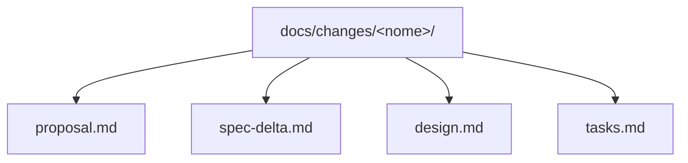

# Processo de mudanças

## Objetivo

Este diretório contém propostas que alteram uma ou mais
[specs de capacidade](../specs/README.md). Enquanto uma proposta está ativa, as
specs continuam descrevendo o comportamento vigente; o delta descreve o estado
desejado.

## Estrutura

- `proposal.md`: problema, objetivo, impacto, estado e questões abertas;
- `spec-delta.md`: requisitos adicionados, modificados ou removidos;
- `design.md`: solução técnica e riscos;
- `tasks.md`: execução e validação.

Use [`template.md`](template.md) para iniciar uma mudança.

## Estados

| Estado | Significado |
|---|---|
| `Draft` | proposta em elaboração |
| `Approved` | delta aceito para implementação |
| `In Progress` | implementação em andamento |
| `Implemented` | implementada, validada e pronta para arquivamento |
| `Rejected` | descartada sem implementação |

## Fluxo

1. Criar proposta e delta em `Draft`.
2. Resolver decisões abertas e identificar todas as specs afetadas.
3. Aprovar requisitos e design, alterando a change para `Approved`.
4. Implementar tarefas e testes.
5. Registrar evidências na proposta.
6. Incorporar o delta às specs de capacidade.
7. Atualizar documentação clássica e changelog.
8. Mover o diretório para `archive/AAAA-MM-DD-<nome>/`.

Correções que apenas restauram um requisito vigente podem dispensar proposta.

## Mudanças ativas

| Mudança | Estado | Specs afetadas |
|---|---|---|
| [Demonstração audível do servo digital](audible-digital-tach-demo/proposal.md) | `Draft` | cinco capacidades vigentes e nova `audio-playback` |
| [Transporte reverso](reverse-transport/proposal.md) | `Draft` | `transport-modes`, `speed-control`, `mechanics-visualization`, `telemetry-and-plots` |

## Arquivo

Consulte [archive/README.md](archive/README.md).
