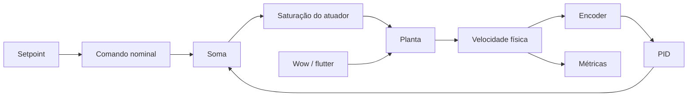

# Design: fundamentos do servo digital

## Componentes



`sim/model.py` permanece como fachada compatível enquanto responsabilidades são
extraídas para módulos próprios. Essa etapa deve preservar o comportamento
vigente antes de ativar os novos modelos.

## Escala e comando nominal

O atuador usa comando adimensional em `[-1, +1]` e a planta usa
`plant_max_rpm = 3000` configurável:

```text
comando_nominal = setpoint_rpm / plant_max_rpm
comando_solicitado = comando_nominal + correção_PID
comando_aplicado = clamp(comando_solicitado, -1, +1)
rpm_alvo = comando_aplicado * plant_max_rpm
```

Tempo usa segundos; velocidade, setpoint e erro usam RPM; perturbações usam
hertz e fração; ângulos visuais usam graus.

## Temporização


Planta, perturbações, encoder e PID compartilham inicialmente `1000 Hz`. A
recuperação por tick é limitada a `100 ms`; o excedente é sinalizado e excluído
das métricas.

## Perturbações

| Componente | Padrão | Taxa característica | Intensidade Dry/Wet | Duração média |
|---|---:|---:|---:|---:|
| Wow | `0,5 Hz`, `±1%`, ocorrência `0%` | `0,1–2,0 Hz` | `0–3%` | `0,5–10 s` (`3 s`) |
| Flutter | `8 Hz`, `±0,3%`, ocorrência `0%` | `2–20 Hz` | `0–1%` | `0,1–3 s` (`0,5 s`) |

Wow e flutter possuem ocorrência (`0–100%`), duração, taxa característica e
amplitude independentes. Quando ambos estão ativos, seus sinais são apenas
somados; `Combined` não é estado nem preset. `Restaurar padrão` zera as
ocorrências e recupera os valores da tabela. Parâmetros mudam em execução
preservando a fase residual, e intensidade usa rampa de `100 ms`.
A perturbação modula a efetividade do acionamento antes da dinâmica da planta.

Um gate determinístico alterna episódios ativos e inativos. A ocorrência define
a fração média do tempo ativo; a duração inativa média é derivada da ocorrência
e da duração ativa média. Cada intervalo recebe fator aleatório uniforme entre
`0,5` e `1,5`. Ocorrência `0%` força inatividade e `100%` força atividade.

Cada componente mistura ruído filtrado, envelope lento e uma senoide residual:

| Componente | Ruído | Senoide | Semente | Envelope |
|---|---:|---:|---:|---:|
| Wow | `85%` | `15%` | `1103` | `2 s` |
| Flutter | `90%` | `10%` | `2207` | `500 ms` |

O ruído escolhe novos alvos a cada meio período característico e os suaviza por
`período / 2π`. O envelope usa outra sequência, com semente consecutiva, e varia
a presença entre aproximadamente `30%` e `100%`. A taxa em hertz controla a
velocidade média das irregularidades, não uma senoide exata.

## Encoder discreto

O encoder incremental possui `100 pulsos/revolução`. A rotação física acumula
frações de pulso a cada passo de `1 ms`; somente pulsos inteiros entram na
contagem. A RPM medida é atualizada a cada `10 ms`:

```text
encoder_rpm_raw = pulsos_da_janela × 60 / (100 × duração_da_janela)
```

Perda percentual decide deterministicamente quais pulsos são descartados;
dropout descarta todos. Depois da contagem, jitter adiciona ruído gaussiano com
escala máxima configurada de `20 RPM`. Todos usam a semente `3301`.

A medição bruta alimenta um passa-baixas de primeira ordem com `τ = 50 ms`:

```text
alpha = 1 - exp(-duração_da_janela / τ)
encoder_rpm_filtered += alpha × (encoder_rpm_raw - encoder_rpm_filtered)
```

Nesta entrega, ambas as medições são observáveis. Planta, controlador
proporcional e animação continuam usando `rpm`; a realimentação pelo encoder
começa com o PID da Issue #7 usando a RPM filtrada. Dropout permanece um sinal
separado porque o filtro leva algum tempo para decair.

## PID e transições

Em `OFF`, a planta recebe somente o comando nominal fixo. Em `ON`, recebe a
mesma base somada ao PID. A derivada atua sobre a medição.

O PID executa a cada `1 ms`, mas a derivada só é recalculada quando o encoder
sinaliza uma nova medição. Ela usa o tempo acumulado entre amostras — tipicamente
`10 ms` — e é mantida até a janela seguinte. Isso evita amplificar em dez vezes
os degraus do encoder.

Os ganhos iniciais demonstrativos são `Kp = 0,001`, `Ki = 0,002` e `Kd = 0`,
todos ajustáveis em execução. O termo derivativo fica disponível, mas começa
zerado porque amplificou a quantização residual do encoder simulado. Esses
valores não representam calibração de hardware.

Em `OFF → ON`, `transfer_bias = -(P + I + D)` produz correção inicial zero e
decai em `250 ms`, inclusive com `Ki = 0`. Em `ON → OFF`, o PID deixa de reagir
ao encoder e sua última correção decai em `250 ms`; os estados são então limpos.

Dropout durante `ON` produz `FALLBACK`: a correção decai em `250 ms` até o
comando nominal, sem alterar a intenção da chave. O retorno dos pulsos reativa o
PID usando a mesma transferência suave de entrada.

## Anti-windup e telemetria

A integral é bloqueada quando o erro aprofunda a saturação e liberada quando
ajuda a sair dela. Seu termo fica entre `-1 - comando_nominal` e
`+1 - comando_nominal`. Back-calculation fica fora do MVP.

A telemetria distingue comando nominal, `P`, `I`, `D`, `transfer_bias`, comandos
solicitado e aplicado, saturação, tempo saturado e bloqueio da integral.

## Metas provisórias de velocidade

Como referência inicial de gravador profissional, o projeto adota a tolerância
de velocidade de `±0,2%` e o drift máximo de `0,1%` publicados para o Studer
A80. Em `1800 RPM`, correspondem respectivamente a `±3,6 RPM` e `±1,8 RPM`.
Especificações de wow/flutter não são comparadas diretamente à RPM bruta do
encoder, cuja quantização é uma propriedade da medição.

O benchmark reproduzível inicial usa:

- `PLAY` em `1800 RPM`;
- wow em `0,5 Hz`, intensidade `1%` e ocorrência `100%`;
- flutter, atrito, jitter, perda de pulsos e dropout desligados;
- descarte dos primeiros `3 s` e medição nos `5 s` seguintes;
- erro calculado sobre a RPM física, não sobre o encoder.

Nesse benchmark, `RMS ≤ 1,8 RPM` (`0,1%`) é a meta e
`RMS ≤ 3,6 RPM` (`0,2%`) é o limite aceitável provisório. Erro máximo e tempo em
saturação são reportados separadamente. As referências são as
[especificações do Studer A80](https://www.vintagedigital.com.au/studer-a80/)
e seu [manual](https://www.scribd.com/document/581382262/Studer-A80-manual).
Esses limites serão revistos pela Issue
[#14](https://github.com/gut0leao/tapepilot-sim/issues/14) após medições físicas.

## Riscos

- A decomposição pode alterar acidentalmente o baseline.
- Parâmetros demonstrativos podem ser confundidos com dados físicos.
- Um PID ajustado apenas na simulação pode não transferir para hardware.
