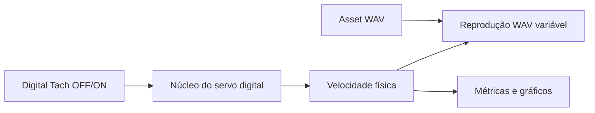

# Design: demonstração audível do servo digital

## Arquitetura proposta



O áudio consome somente a velocidade física da planta. Encoder e PID podem
afetá-lo apenas indiretamente pela reação do controlador sobre a planta.

## Áudio

O spike pode avaliar `QMediaPlayer`, mas o MVP controlado deve preferir WAV PCM
e resampling variável. A posição da fonte avança aproximadamente por:

```text
source_position += tape_speed / nominal_tape_speed
```

Buffering e processamento ficam separados do tick da interface. A resolução de
assets deve ser concluída antes da introdução do WAV.

## Comparação

A mesma amostra e configuração de perturbações deve ser usada em `OFF` e `ON`.
A interface apresenta erro RMS, desvio máximo, overshoot e tempo em saturação,
sem duplicar toda a telemetria interna do núcleo.

## Riscos

- Resampling simples pode introduzir aliasing ou clicks.
- Um transiente de áudio pode ser confundido com efeito do controlador.
- A amostra escolhida pode não evidenciar wow e flutter.
