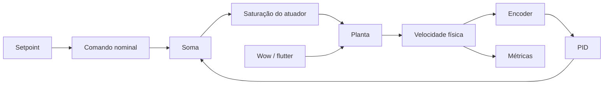

# Design: fundamentos do servo digital

## Componentes



`sim/model.py` permanece como fachada compatível enquanto responsabilidades são
extraídas para módulos próprios. Essa etapa deve preservar o comportamento
vigente antes de ativar os novos modelos.

## Escala e comando nominal

O atuador usa comando adimensional em `[-1, +1]` e a planta usa
`plant_max_rpm = 3000` configurável:

```text
comando_nominal = setpoint_rpm / plant_max_rpm
comando_solicitado = comando_nominal + correção_PID
comando_aplicado = clamp(comando_solicitado, -1, +1)
rpm_alvo = comando_aplicado * plant_max_rpm
```

Tempo usa segundos; velocidade, setpoint e erro usam RPM; perturbações usam
hertz e fração; ângulos visuais usam graus.

## Temporização


Planta, perturbações, encoder e PID compartilham inicialmente `1000 Hz`. A
recuperação por tick é limitada a `100 ms`; o excedente é sinalizado e excluído
das métricas.

## Perturbações

| Componente | Padrão | Frequência | Amplitude |
|---|---:|---:|---:|
| Wow | `0,5 Hz`, `±1%` | `0,1–2,0 Hz` | `0–3%` |
| Flutter | `8 Hz`, `±0,3%` | `2–20 Hz` | `0–1%` |

Os presets `Wow`, `Flutter` e `Combined` são demonstrativos. Parâmetros mudam em
tempo de execução preservando fase; ativação e desativação usam rampa curta. A
perturbação modula a efetividade do acionamento antes da dinâmica da planta.

## PID e transições

Em `OFF`, a planta recebe somente o comando nominal fixo. Em `ON`, recebe a
mesma base somada ao PID. A derivada atua sobre a medição.

Em `OFF → ON`, `transfer_bias = -(P + I + D)` produz correção inicial zero e
decai em `250 ms`, inclusive com `Ki = 0`. Em `ON → OFF`, o PID deixa de reagir
ao encoder e sua última correção decai em `250 ms`; os estados são então limpos.

## Anti-windup e telemetria

A integral é bloqueada quando o erro aprofunda a saturação e liberada quando
ajuda a sair dela. Seu termo fica entre `-1 - comando_nominal` e
`+1 - comando_nominal`. Back-calculation fica fora do MVP.

A telemetria distingue comando nominal, `P`, `I`, `D`, `transfer_bias`, comandos
solicitado e aplicado, saturação, tempo saturado e bloqueio da integral.

## Riscos

- A decomposição pode alterar acidentalmente o baseline.
- Parâmetros demonstrativos podem ser confundidos com dados físicos.
- Um PID ajustado apenas na simulação pode não transferir para hardware.
