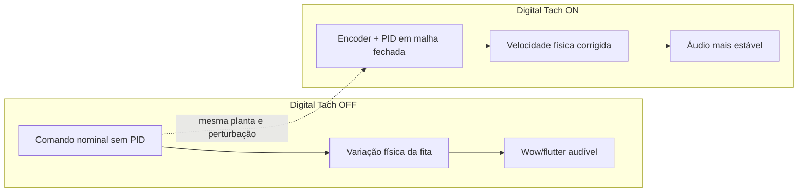

# Visão do produto

## Problema

Tape decks profissionais dependem de sistemas de medição e controle de
velocidade que podem se degradar ou falhar. Variações na velocidade física da
fita produzem instabilidade de afinação e tempo, percebida como wow e flutter.

## Visão

O TapePilot deve apoiar o desenvolvimento de um controlador digital embarcado
para estabilizar a velocidade do capstan e, futuramente, substituir sistemas de
controle defeituosos em equipamentos profissionais.

O simulador deve permitir comparar a mesma planta e as mesmas perturbações em
dois cenários:

## Evidência desejada

A estratégia será avaliada por três formas complementares:

- audição de uma amostra cuja velocidade acompanha a fita simulada;
- gráficos da planta, medição, erro e atuação;
- métricas como erro RMS, desvio máximo, overshoot e saturação.

O áudio é um instrumento de percepção da velocidade física. Ele não representa
simulação de qualidade sonora, eletrônica de áudio, ruído de fita ou resposta em
frequência.

## Caminho até o produto

1. Demonstrar o conceito contra uma planta simulada.
2. Tornar perturbações e comparações reproduzíveis.
3. Caracterizar um mecanismo real por medições.
4. Ajustar e validar o modelo com dados reais.
5. Implementar o controlador em uma plataforma embarcada adequada.
6. Validar segurança, compatibilidade e desempenho em hardware.

Até a fase de hardware, a documentação usa o termo genérico **controlador
embarcado**. A escolha entre ESP32, Raspberry Pi Pico ou outra plataforma será
feita quando requisitos de entradas, saídas, temporização e atuação forem
conhecidos.

## Limites atuais

- O simulador não comprova sozinho a eficácia em um equipamento real.
- Compatibilidade elétrica e mecânica ainda não foi estudada.
- Sensor, atuador e modelos de tape deck alvo ainda não foram escolhidos.
- Nenhuma alegação comercial deve se apoiar apenas nos resultados simulados.
